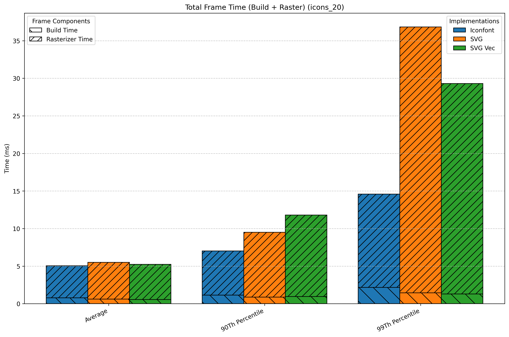
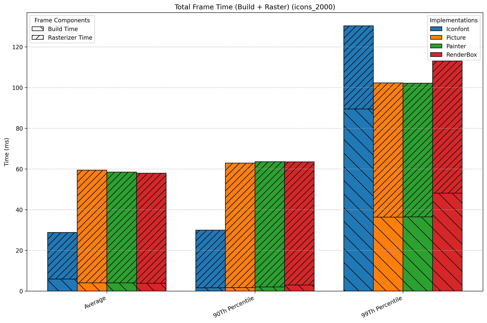

# SVG vs Iconfont

A comparison between SVG and Iconfont performance in Flutter.

To get the reports, use the following command:

```bash
flutter drive \
  --driver=test_driver/perf_driver.dart \
  --target=integration_test/performance_test.dart \
  --profile --no-dds
```

The results will be saved in the `build` directory. Open `iconfont.timeline_summary.json` and `svg.timeline_summary.json` to compare the performance metrics.

## Results

To view the results I measured on my Macbook M4 Pro, open the `create_report/metrics` folder.




## How this benchmark works

There are 20 and 2000 icons that are displayed in a grid view with X items (25 columns). The icons are repeated to fill the grid. The performance is measured by scrolling the grid view.

- SVG icons are loaded from assets using `flutter_svg` package.
- Iconfont icons are loaded from a custom icon font created by `icon_font_generator` package.

## How to compile SVG to vector graphics

This project also includes a benchmark for SVGs compiled to an optimized binary format using the `vector_graphics` package.

1.  Run the compiler. This command will take the SVGs from `assets/icons` and 
    create optimized `.vec` files in `assets/icons_vec`.

    ```bash
    dart run vector_graphics_compiler --input-dir "assets/icons" --out-dir "assets/icons_vec" --font-size=24
    ``` 

## How to generate the icon font

The project uses `icon_font_generator` to create a font file and a Dart class from SVG icons in the `assets/icons` directory.

1.  Make sure you have `icon_font_generator` globally activated:
    ```bash
    dart pub global activate icon_font_generator
    ```

2.  Run the generator. This command will take the SVGs from `assets/icons`, 
    create `assets/iconfont/Symbols.otf`,   and generate the Dart mapping file at `lib/icons/symbols.gen.dart`.
    ```bash
    dart pub global run icon_font_generator:generator assets/icons assets/iconfont/Symbols.otf --font-name Symbols --class-name Symbols -r -v --normalize -o lib/icons/symbols.gen.dart --no-ignore-shapes
    ```
3. Run the script symbols_gen.dart to add `const List<IconData> values` to the symbols.dart file.
    ```bash
    dart .\bin\symbols_gen.dart
    ```

## How to generate the widgets

This project also includes a benchmark for SVGs compiled to Flutter Widgets using the `svg2dart` package.

1.  Make sure you have `svg2dart` globally activated:
    ```bash
    dart pub global activate svg2dart
    ```

2.  Run the generator. This command will take the SVGs from `assets/icons` and 
    create Dart files with `Widget` classes at `lib/widgets`.
    ```bash
    svg2dart -i assets/icons -o lib/widgets/
    ```

3. Run the script widgets_all_gen.dart to generate `lib/widgets/_all.dart` file.
    ```bash
    dart .\bin\widgets_all_gen.dart
    ```

## How to create charts

- Install [uv](https://github.com/astral-sh/uv) package manager`
- cd to the create_report
- Run `uv run main.py`
